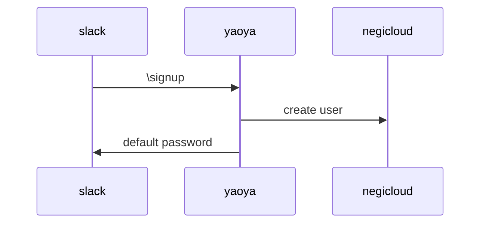
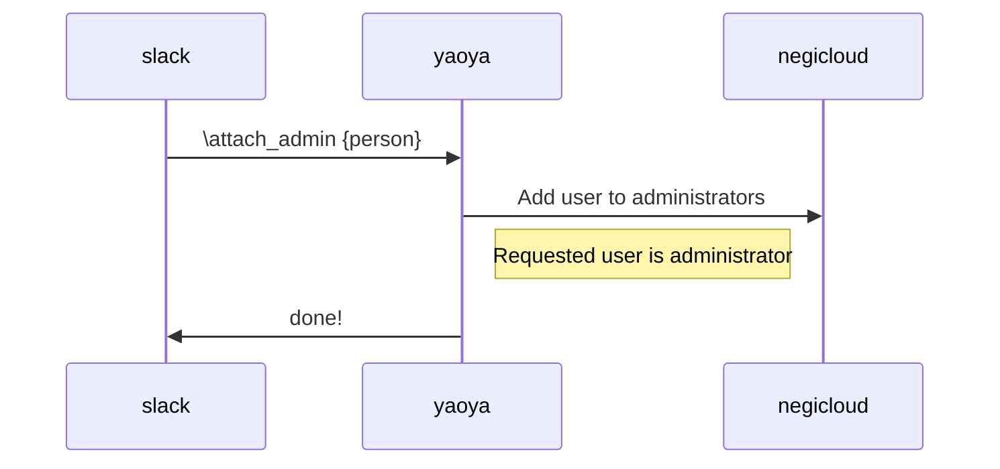

# Yaoya

Negicloud acccount management platform

## Workflow

### Signup with default(Normal committee-member) role

```mermaid
sequenceDiagram
    participant slack
    participant yaoya
    participant negicloud
    slack->>yaoya: \signup
    yaoya->>negicloud: create user
    yaoya->>slack: default password
```

### Attach new role

```mermaid
sequenceDiagram
    participant slack
    participant yaoya
    participant negicloud
    slack->>yaoya: \attach_admin {person}
    yaoya->>negicloud: Add user to administrators
    Note right of yaoya: Requested user is administrator
    yaoya->>slack: done!
```
